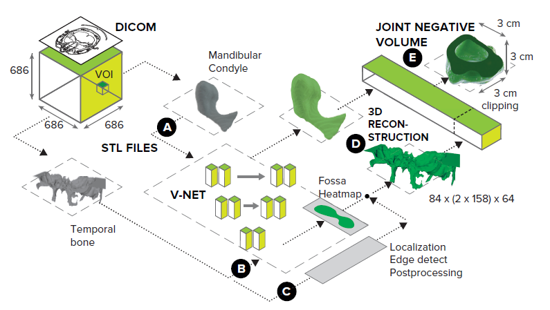
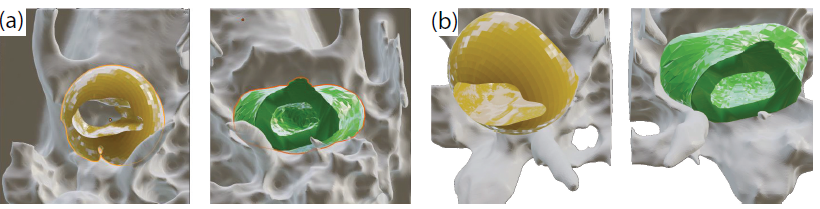

# Deep Negative Volume Segmentation

We propose a new intuitive hybrid strategy for medical 3D image segmentation, entailing new manual annotation pipeline, localization-based image enhancement, deep learning based segmentation, and surface mesh inflation. The framework extracts “negative volumes” in complex anatomical structures in an end-to-end manner, which we validated on a head-CT dataset by segmenting the most complex human joint (the TMJ) together with maxillofacial experts.

<p align="center">


</p>
<p >
<em>Fig. 1. End-to-end pipeline for Deep Negative Volume Segmentation. As an example, we take the most complex object in a human body - temporomandibular joint (TMJ), consisting of the mandibular condyle (MC) and the temporal bone (TB).
Segmentation of MC and TB are shown as step A and step B, respectively. Step C and step D represent classical image
enhancement of TB and 3D reconstruction of both bones. The “inflation/clipping” block represented by Step E.
</p>

## Requirements

To install requirements:

```setup
pip install -r requirements.txt
```
## Training

To train the models used in the paper, run this command:

```train
python train.py --config <path_to_config_file>
```

where path_to_config_file is the path to a configuration file, which specifies all aspects of the training procedure.
See e.g. config.txt for example how to specify training a standard V-Net with Dice + Cross-Entropy loss.

## Evaluation

To evaluate models, run:

```eval
python eval.py --config <path_to_config_file>
```

## Pre-trained Models

You can download pretrained models here:
- Pre-trained V-Net model for object loclization: https://drive.google.com/drive/folders/1qUtlMfNEBMQakJpmGQWiKTrwY59vpbom?usp=sharing
- 3D U-Net and V-Net for spherical negative volumes segmentation: https://drive.google.com/drive/folders/1-Ctq56kAMF3B24SdLJ_i00zc5Rb1rIze?usp=sharing 
- 3D U-Net, 3D U-Net with attention gates, and V-Net trained with different loss function on mandibular condyle: https://drive.google.com/drive/folders/1uODu_VFmaOmVgWD7GNQ0kjdnZtQRDe7c?usp=sharing
- 3D U-Net, 3D U-Net with attention gates, and V-Net trained with different loss function on temporal bone: https://drive.google.com/drive/folders/1hLwS0J09u6Qz5_cpz4a-MyKEmnjeGVh4?usp=sharing

## Results

Table 1. Mandibular condyle (MC), temporal bone (TB) and negative volume (NV) segmentation
results. Notice that the whole-object 3D segmentation of the manually annotated “balls” from Fig.1
need more data to work properly, justifying the development of our automated pipeline which just
needs MC and TB masks.

<p align="center">


</p>
<p >
<em>Fig. 2. Rendered regions of the TB (gray) featuring manually annotated negative volume (yellow),
and a machine-generated one (green). Views: (a) axial, from bottom (b) same, tilted.
</p>
